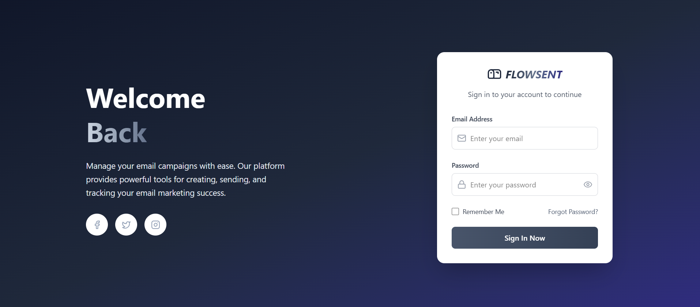
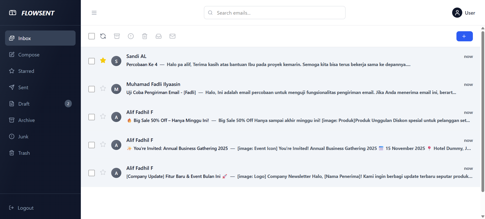

# 📧 FlowSent — React Webmail Client


FlowSent adalah aplikasi **webmail client** berbasis **React (frontend)** dan **Laravel (backend)**.  
Dibuat untuk memberikan pengalaman mirip layanan email populer dengan fitur **mengirim, menerima, dan mengelola email** dalam satu platform modern.

---

## ✨ Fitur Utama

- **Inbox, Sent, Drafts, Starred, Archive, Junk, Trash**
- Kelola email berdasarkan folder

- **Compose Email**
- Modal Compose untuk menulis email baru + attachment

- **Email Detail**
- Lihat isi email lengkap, header, body, dan lampiran
- Preview file (gambar, PDF, teks)

- **Bulk Actions**
- Seleksi banyak email → move to archive, move to trash, move to spam, mark as read, delete permanent, refresh.

- **UI Modern**
- Sidebar navigasi, topbar dengan search global, notifikasi interaktif, modal preview, dll

---

## 🖼️ Tampilan Utama

> Halaman Login



---

> Halaman Utama



---

## 🚀 Quick Start

Sebelum memulai, pastikan sudah menginstall:
- PHP >= 8.3.x
- Composer
- Laravel CLI
- Git
- WSL Ubuntu (opsional)

### 1. Clone Repository

```bash
git clone -b fadli git@source.kirim.email:internship/flowsent-back.git (SSH)
git clone -b fadli https://source.kirim.email/internship/flowsent-back.git (HTTPS)
cd flowsent-back
```

Untuk git clone -b fadli ini agar melakukan clone ke folder proyeknya karena berada di branch fadli

### 2. Setup Backend (Laravel)

Jalankan Backend,

```bash
composer install

#Ini untuk mengaktifkan cache pada redis di docker
docker compose up -d --build redis

#Ini untuk menjalankan semua tugas terjadwal (jobs) secara otomatis
php artisan schedule:work

php artisan serve
```

Backend akan berjalan di `http://127.0.0.1:8000`,.

### 3. Setup Frontend (React + Vite)

```bash
cd frontend
npm install
npm run dev
```

Frontend akan berjalan di `http://localhost:5173`.

---

## 🛠️ Tech Stack

- **Frontend:** React + Vite + Tailwind + Context API
- **Backend:** Laravel + Docker
- **Icons:** Lucide React
- **State:** EmailContext (custom Context API)

---

## 📚 Dokumentasi Lengkap

- [Overview](docs/features/overview.md)
- [API Endpoints](docs/api/endpoints.md)
- [Authentication](docs/features/auth.md)
- [Email management](docs/features/email-management.md)

---

Proyek ini dikembangkan sebagai bagian dari program magang untuk mempelajari pengembangan aplikasi webmail client.

---

## Catatan

-   Semua endpoint API berada di prefix `/api`
-   Sebagian besar fitur dilindungi oleh middleware `auth.token` (JWT)
-   Dokumentasi ini akan diperbarui seiring penambahan fitur baru
