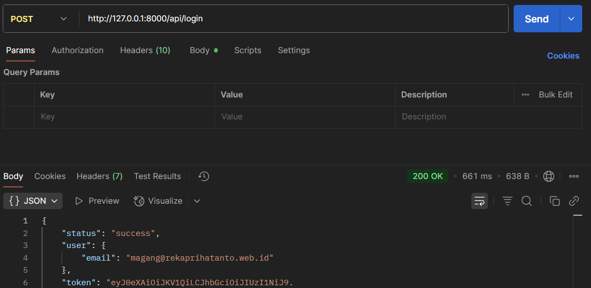
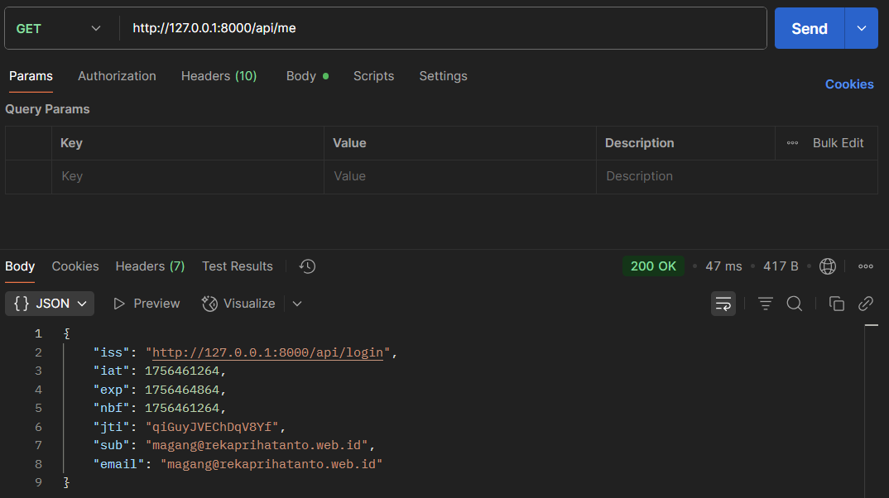
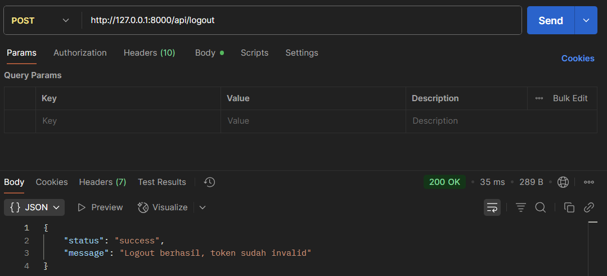

# Auth Feature

## Deskripsi

Fitur autentikasi untuk mengelola akses user ke API backend.  
Menggunakan JWT untuk proses login, otorisasi, dan proteksi endpoint.

## Tujuan

-   Membatasi akses hanya untuk user yang valid
-   Memberikan token sebagai identitas user untuk request selanjutnya
-   Memungkinkan logout agar token tidak bisa dipakai lagi

## Endpoint

-   `POST /login`  
    Login dengan credential (email & password). Menghasilkan JWT token.
-   `POST /logout`  
    Logout dan menghapus token aktif. Hanya bisa diakses jika login.
-   `GET /me`  
    Mendapatkan data user yang sedang login. Token harus valid.

## Fungsionalitas

-   [x] Login user dengan validasi credential
-   [x] Generate JWT token
-   [x] Proteksi endpoint menggunakan middleware `auth.token`
-   [x] Logout user
-   [ ] Refresh token (belum tersedia)

## Alur Singkat

1. User mengirim email & password ke `/login`
2. Backend memverifikasi data → generate JWT token
3. Token dipakai di header `Authorization: Bearer <token>`
4. Saat logout, token dihapus/dibuat invalid

## Catatan Teknis

-   Menggunakan package JWT Laravel (tymon/jwt-auth)
-   Token disimpan sementara dan dicek oleh middleware `auth.token`

## Screenshot

-   Tampilan output endpoint POST /Login

    > 

-   Tampilan output endpoint GET /me

    > 

-   Tampilan output endpoint POST /logout

    > 
