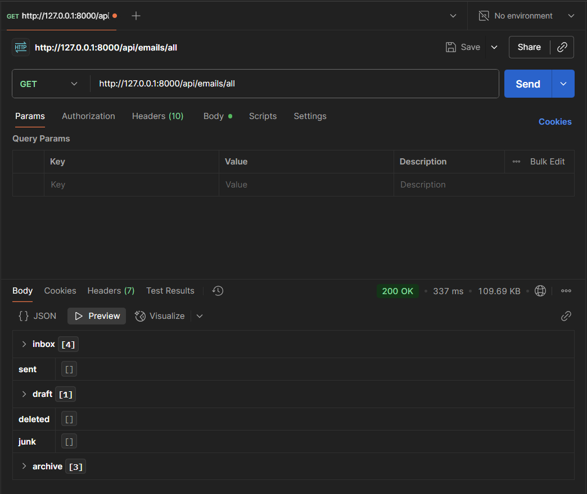
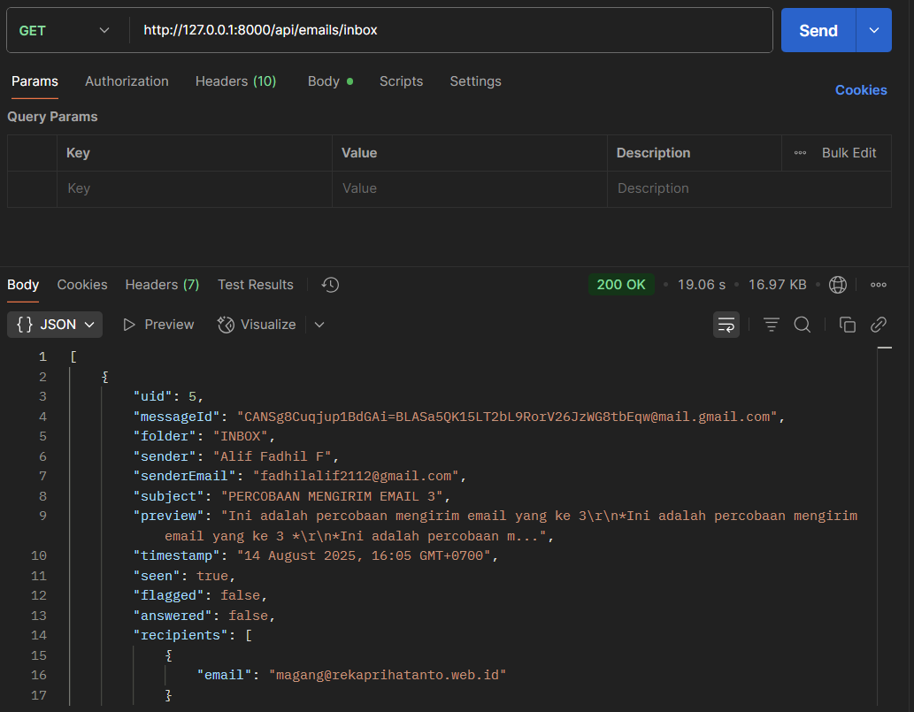
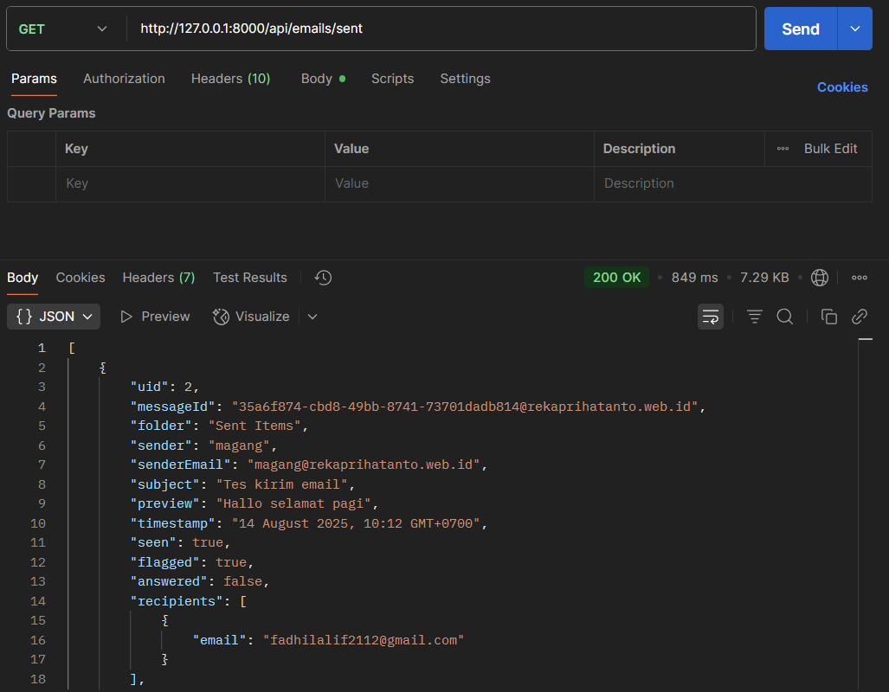
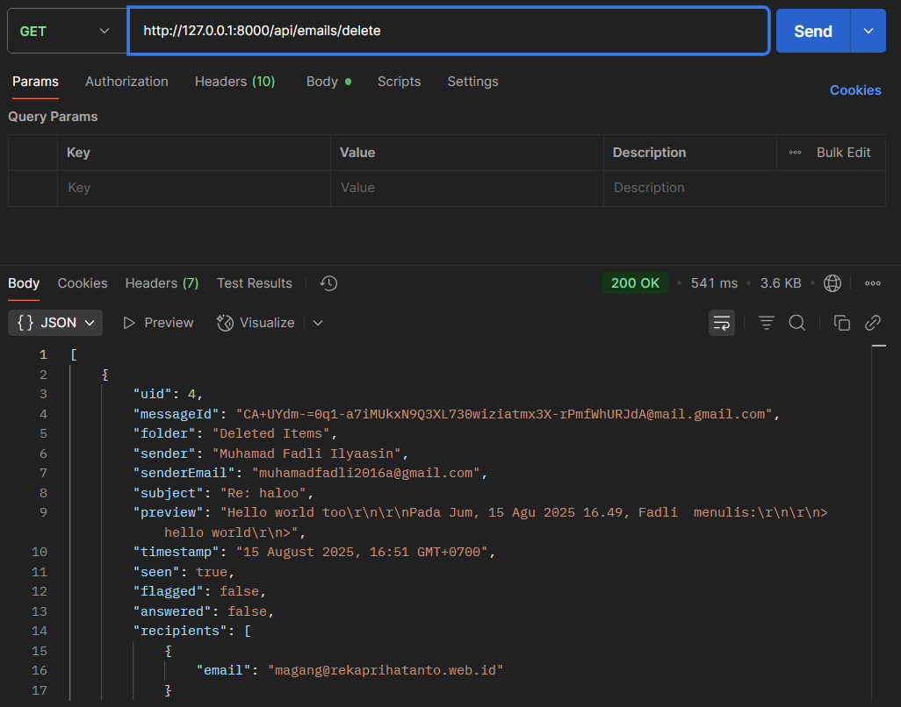
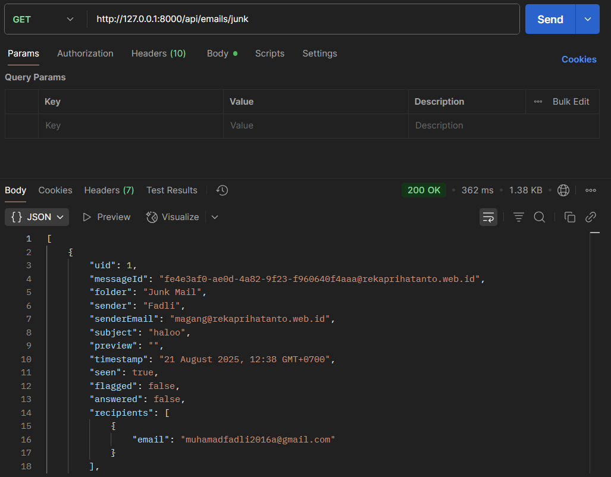
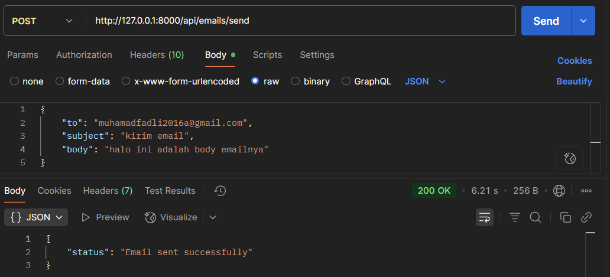

# Email Management Feature

## Deskripsi

Fitur untuk mengelola email yang terhubung ke server IMAP/SMTP.  
Mencakup pengambilan daftar email, filtering berdasarkan folder, serta manajemen status (draft, sent, delete, junk).

## Tujuan

-   Menyediakan API agar frontend (React) bisa menampilkan email user
-   Memudahkan navigasi email berdasarkan kategori
-   Menjadi pondasi utama webmail client Flowsent

## Endpoint

-   `GET /emails/all` : Mendapatkan semua email
-   `GET /emails/inbox` : Mendapatkan email di folder Inbox
-   `GET /emails/sent` : Mendapatkan email terkirim
-   `GET /emails/draft` : Mendapatkan email draft
-   `GET /emails/delete` : Mendapatkan email yang dihapus
-   `GET /emails/junk` : Mendapatkan email spam/junk
-   `POST /emails/send` : Kirim email baru

## Fungsionalitas

-   [x] Menampilkan semua email
-   [x] Ambil daftar email dari berbagai folder
-   [x] Ambil detail email berdasarkan folder & UID
-   [x] Mendukung pagination/limit default (contoh: 20 email terbaru)
-   [x] Kirim email
-   [ ] Kirim email dengan attachment (belum tersedia)
-   [ ] Hapus permanen email (belum tersedia)

## Alur Singkat

1. User login → dapat JWT token
2. Frontend request email → API mengambil dari IMAP server
3. API response berupa JSON list email

## Catatan Teknis

-   Menggunakan package `Webklex/IMAP` untuk komunikasi dengan server email
-   Endpoint dilindungi oleh middleware `auth.token`
-   Default limit = 20 email terbaru

## Screenshot

-   Tampilan output endpoint GET /emails/all

    > 

-   Tampilan output endpoint GET /emails/inbox

    > 

-   Tampilan output endpoint Get /emails/sent

    > 

-   Tampilan output endpoint Get /emails/draft

    > 

-   Tampilan output endpoint Get /emails/delete

    > 

-   Tampilan output endpoint Get /emails/junk

    > 

-   Tampilan output endpoint POST /emails/send

    > 
