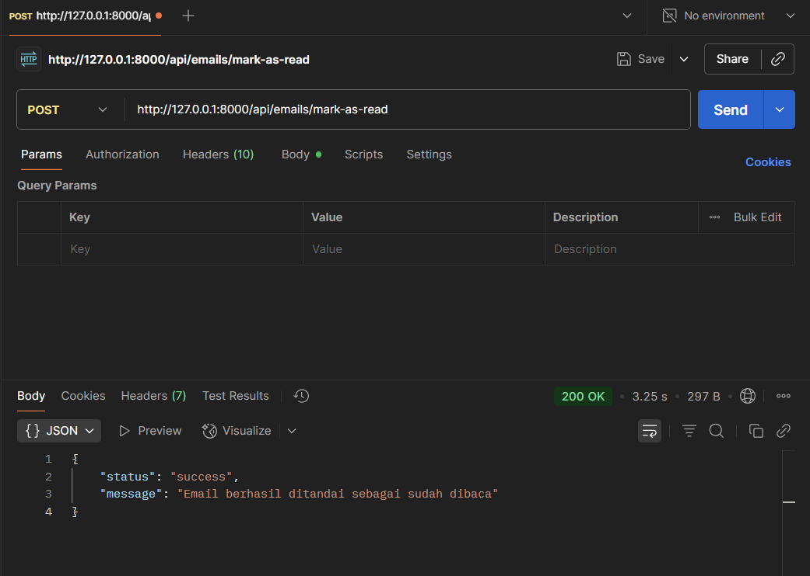
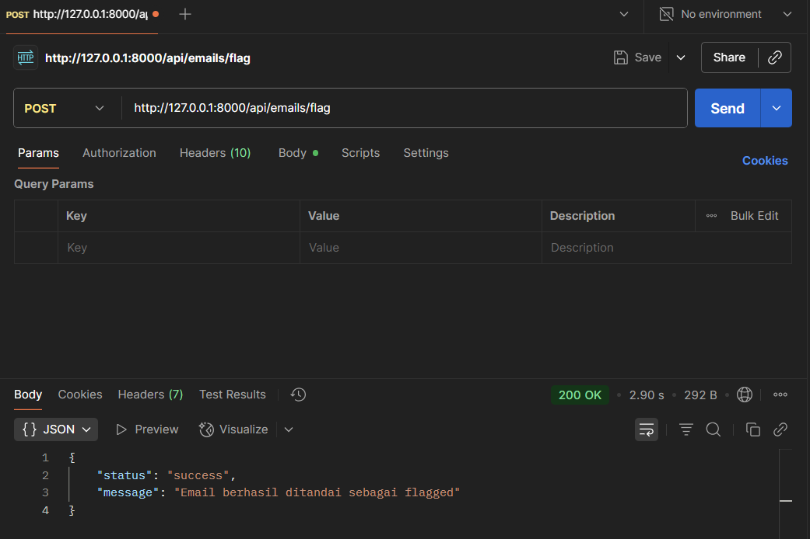
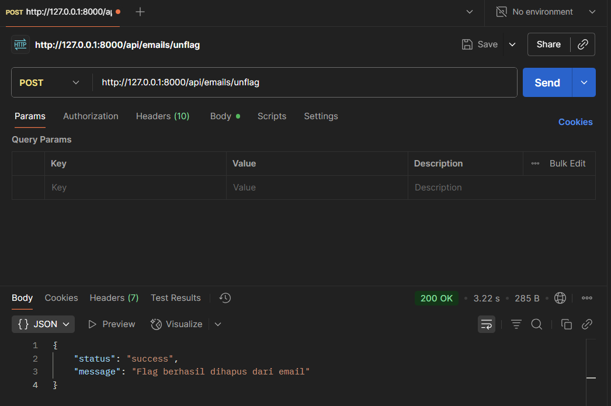
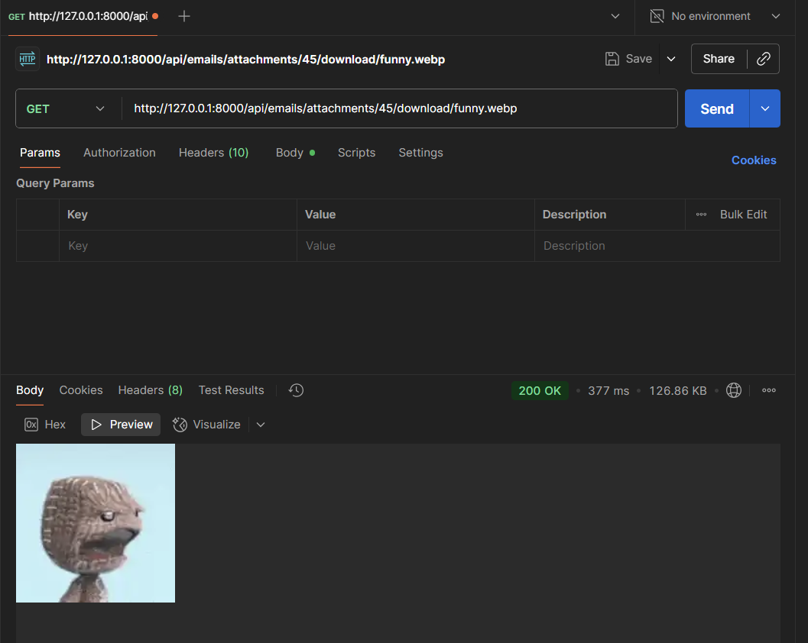
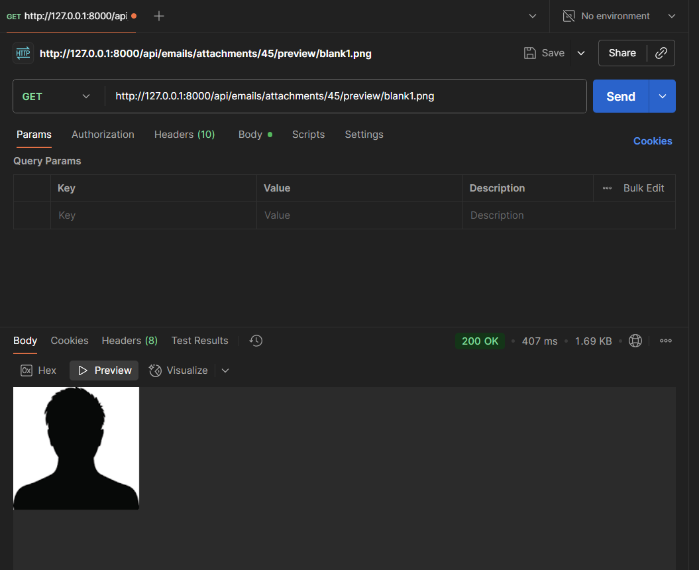

# Email Management Feature

## Deskripsi

Fitur untuk mengelola email yang terhubung ke server IMAP/SMTP.  
Mencakup pengambilan daftar email, filtering berdasarkan folder, manajemen status, draft, pengiriman, dan attachment.

## Tujuan

-   Menyediakan API agar frontend (React) bisa menampilkan email user
-   Memudahkan navigasi email berdasarkan kategori
-   Menjadi pondasi utama webmail client Flowsent

## Endpoint

- `GET /emails/all` : Mendapatkan semua email
- `POST /emails/mark-as-read` : Tandai email sebagai sudah dibaca
- `POST /emails/flag` : Tandai email sebagai penting (flagged)
- `POST /emails/unflag` : Hapus tanda penting (unflag)
- `POST /emails/move` : Pindahkan email antar folder
- `DELETE /emails/delete-permanent-all` : Hapus permanen semua email dalam folder
- `POST /emails/draft` : Simpan email sebagai draft
- `POST /emails/send` : Kirim email baru
- `GET /emails/attachments/{uid}/download/{filename}` : Unduh attachment
- `GET /emails/attachments/{uid}/preview/{filename}` : Preview attachment

## Fungsionalitas

- [x] Menampilkan semua email
- [x] Ambil daftar email dari berbagai folder
- [x] Ambil detail email berdasarkan folder & UID
- [x] Mendukung pagination/limit default (contoh: 20 email terbaru)
- [x] Tandai email (read/unread, flagged/unflagged)
- [x] Pindahkan email antar folder
- [x] Kirim email
- [x] Simpan draft email
- [x] Unduh & preview attachment
- [x] Hapus permanen email

## Alur Singkat

1. User login → dapat JWT token
2. Frontend request email → API mengambil dari IMAP server
3. API response berupa JSON list email

## Catatan Teknis

-   Menggunakan package `Webklex/IMAP` untuk komunikasi dengan server email
-   Endpoint dilindungi oleh middleware `auth.token`
-   Default limit = 20 email terbaru

## Screenshot

-   Tampilan output endpoint GET /emails/all

    > 

-   Tampilan output endpoint GET /emails/mark-as-read

    > 

-   Tampilan output endpoint Get /emails/flag

    > 

-   Tampilan output endpoint Get /emails/unflag

    > 

-   Tampilan output endpoint Get /emails/download

    > 

-   Tampilan output endpoint Get /emails/preview

    > 

-   Tampilan output endpoint POST /emails/send

    > 
